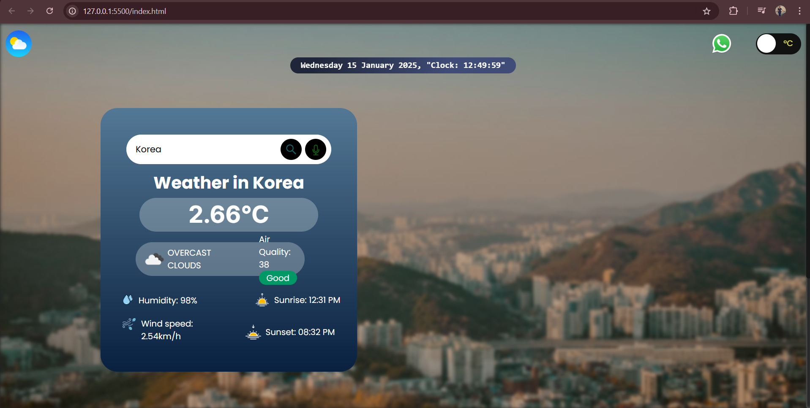
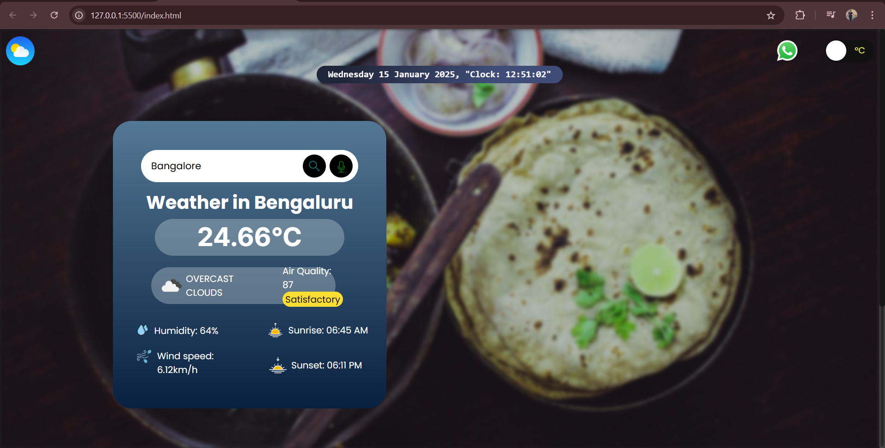
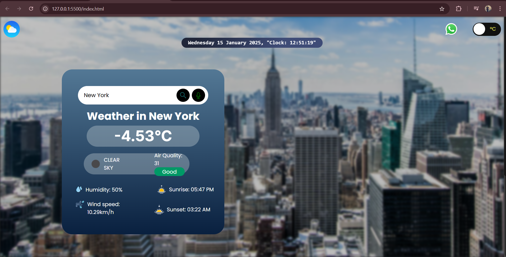

# 🌦️ Weather App

Welcome to the Weather App! This project is a JavaScript application that fetches and displays real-time weather data for any city you search. 🌍

## 📖 Description

This Weather App is built using HTML, CSS, and JavaScript, with data fetched from the OpenWeather API. It's designed to help beginners understand the following concepts:

🌐 Fetching data from third-party APIs using fetch().

🎨 Manipulating the DOM to display dynamic content.

🛠️ Building responsive and interactive UI components.

## 🎯 Features

🌟 Search for weather in any city worldwide.

🌡️ Displays:

Temperature (Celsius/Fahrenheit).

Weather conditions (e.g., Sunny, Cloudy, Rainy).

Humidity and wind speed.

🕶️ User-friendly interface with responsive design.

🖼️ Screenshots

🌟 Home Page

🌍 Search Results

## 🚀 How to Use
Clone this repository:

```bash```  ```git clone https://github.com/pragti-124/Weather-api.git```

```cd weather-app```

Open the ```index.html``` file in your browser to view the app.

Enter the name of a city in the search bar and click "Search" to view the current weather.

## 🔧 Installation & Setup

Get your free API key from OpenWeather API.

Replace the placeholder in the code with your API key:

```javascript``` ```const API_KEY = "your_api_key_here";```

Run the app locally using any live server (e.g., VS Code Live Server).

## 🛠️ Technologies Used

HTML: Structuring the app's layout.

CSS: Styling the app with modern and responsive designs.

JavaScript: Handling API requests and DOM manipulations.

OpenWeather API: Fetching real-time weather data.

## 🌐 API Information

Base URL: https://api.openweathermap.org/data/2.5/weather

Example API Call:

```bash``` ```https://api.openweathermap.org/data/2.5/weather?q=London&appid=your_api_key```

Documentation: https://openweathermap.org/guide

## 🌟 Acknowledgments

OpenWeather API for providing weather data.

## 📜 License

This project is licensed under the MIT License. See the LICENSE file for details.

## 📸 Screenshots
Here are a few snapshots of the weather app in action:




